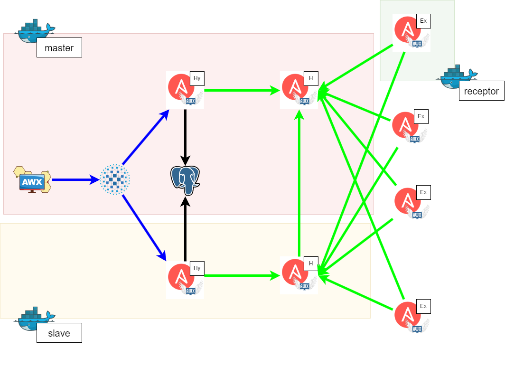

# AWX-Deploy

## はじめに

awx を docker-composeで利用するためのリポジトリ

## 動作条件

- docker-ce
- docker compose >= 1.28
  - docker-compose.yml >= 3.9 以上を扱えること

## システム構成

本repoには profilesによって3つのdocker-composeを作るようになっています。
それぞれのprofilesに含まれるコンテナ、構成配下の通り




## 起動方法

- repoを clone もしくは fetchする
- .envを編集し、ホスト情報を構成する
 - awx_1(master) と awx_2(slave) は別ホストで起動する事を想定しています
 - dnsを別途指定したりするなどして名前解決が行える場合を除きIP
 アドレスを記載してください
- ホスト毎にiptables/firewalld等を適宜空ける
- master nodeのdocker-composeから起動する
  - 最低でもdb migration が完了し、完全に起動するまではslaveを起動しないこと

- 事前編集

```bash
 git clone https://github.com/ainamori/awx-deploy.git
 cd awx-deploy
 vim .env
```

- 起動

```bash
 docker compose up -d
```

起動すると以下のとおりアクセスができる
- UI
  -  `https://awx_1_server_ip:3000`
- API
  -  `http://awx_1_server_ip:8013`

*) ログイン情報 `admin`/.envで指定した `AWX_SUPERUSER_PASSWORD`

## awx_1 と awx_2 の結合

UIのトポロジービューを見ると分かるがこのままでは awx_1 と awx_2 が独立していて相互で機能していない。
また、receptor-hopも存在していない。

これはreceptorの経路とAWXトポロジ（インスタンス）は別管理になっているからら。


```bash
docker exec -it awx_1 awx-manage provision_instance --hostname="receptor-hop_1" --node_type="hop" && \
docker exec -it awx_1 awx-manage provision_instance --hostname="receptor-hop_2" --node_type="hop" && \
docker exec -it awx_1 awx-manage register_peers "receptor-hop_1" --peers "awx_1" && \
docker exec -it awx_1 awx-manage register_peers "receptor-hop_1" --peers "awx_2" && \
docker exec -it awx_1 awx-manage register_peers "receptor-hop_2" --peers "awx_1" && \
docker exec -it awx_1 awx-manage register_peers "receptor-hop_2" --peers "awx_2" && \
docker exec -it awx_1 awx-manage register_peers "receptor-hop_2" --peers "receptor-hop_1"
```

- awx_2 で行う場合は docker exec 先を awx_2 に変更する


### Excecution nodeの追加

AWXのコントロールプレーンを持たない、実行のみのノードを追加する場合は以下の通り

receptorはデフォルトではdocker母艦のhostnameで起動するようになっているため、instanceはホスト名で登録する

```bash
export EXECUTION_NODENAME="<登録するExcecution node の hostnameコマンド結果>"
docker exec -it awx_1  awx-manage provision_instance --hostname="${EXECUTION_NODE}" --node_type="execution" && \
docker exec -it awx_1  awx-manage register_peers "${EXECUTION_NODE}" --peers "receptor-hop_1" && \
docker exec -it awx_1  awx-manage register_peers "${EXECUTION_NODE}" --peers "receptor-hop_2"
```

# Tips

## receptorの確認方法

```bash
docker exec -it awx_1 receptorctl status
```

## Control Planeの追加

```bash
awx-manage provision_instance --hostname="$(hostname)" --node_type="$MAIN_NODE_TYPE"
awx-manage register_queue --queuename=controlplane --instance_percent=100
awx-manage register_queue --queuename=default --instance_percent=100
```

## Execution hopの追加

```bash
 awx-manage provision_instance --hostname="receptor-hop" --node_type="hop"
 awx-manage register_peers "receptor-hop" --peers "awx_1"
```

## Execution nodeの追加

```bash
 awx-manage provision_instance --hostname="receptor-$e" --node_type="execution"
 awx-manage register_peers "receptor-$e" --peers "receptor-hop"
```

### 参考

- [awx-without-k8s](https://github.com/fitbeard/awx-without-k8s)
